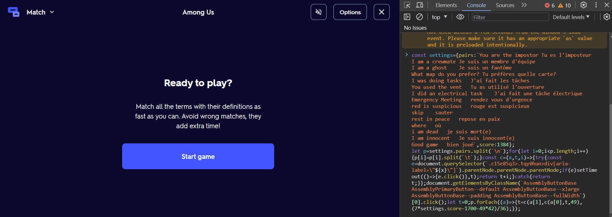
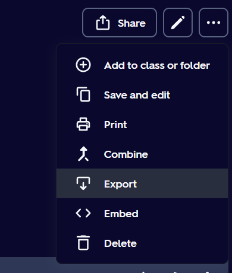
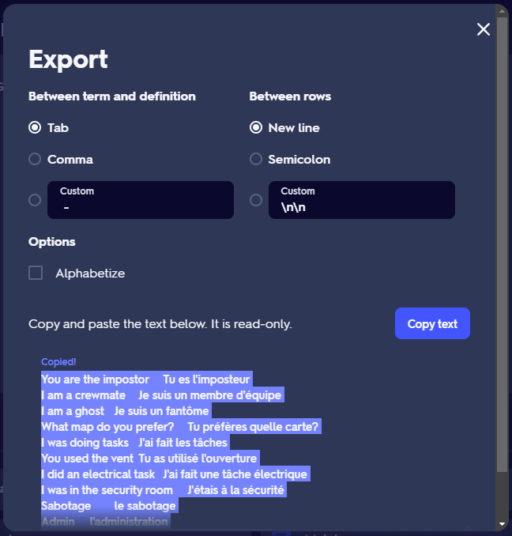
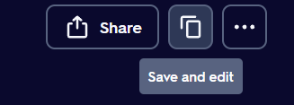

# Quizlet Match "Cheat" for Updated Quizlet

---

IMPORTANT:

<b>RUN THE CODE BEFORE PRESSING THE "Start game" BUTTON.</b>

<b>CODE MAY <u>ONLY</u> BE RUN WHEN YOU SEE THE "Start game" BUTTON. THE CODE DOES NOT WORK WITH THE "Play again" BUTTON.</b>

---

The following can achieve a min 1.3s score for any Quizlet Match set:

```js
const settings = {
  pairs: ``,
  score: 1400, // check github score setting for minimum score values
};

let p = settings.pairs.split(`\n`);
for (let i = 0; i < p.length; i++) {
  p[i] = p[i].split(`\t`);
}
const c = (x, t, i) => {
  try {
    const e = document.querySelector(
      `.c15e85q3>.tqy0hun>div[aria-label="${x}"]`
    ).parentNode.parentNode.parentNode;
    if (e)
      setTimeout(() => {
        e.click();
      }, t);
    return t + i;
  } catch {
    return t;
  }
};
document
  .getElementsByClassName(
    `AssemblyButtonBase AssemblyPrimaryButton--default AssemblyButtonBase--xlarge AssemblyButtonBase--padding AssemblyButtonBase--fullWidth`
  )[0]
  .click();
let t = 0;
p.forEach((a) => {
  t = c(a[1], c(a[0], t, 49), (7 * settings.score - 1700 - 49 * 42) / 36);
});
```

## Usage

To use, paste the code above (with settings modified as necessary) into the console of Chrome DevTools, which can be accessed on most browsers by right click → inspect → console (on the top). Then, run the code.


<p style="line-height:1.2rem;">
<sup>note: above image contains old versions of this code, but the concept of pasting into devtools is the same.</sup></p>

To re-run the program at the "Play again" page, refresh the page, then paste + run the code again in DevTools.

## Settings

`settings` can be edited as follows:

- `pairs` is a string which contains the term-definition pairs in the quizlet set.

  - On a set you own, `pairs` is equal to the default export text.

  
  

  After copying the text, paste the result in-between the two ` `` ` characters following `pairs:`. Do not add extra new-lines, tabs, or spaces. For example:

  ```js
  const settings = {
    pairs: `You are the impostor	Tu es l'imposteur
  I am a crewmate	Je suis un membre d'équipe
  I am a ghost	Je suis un fantôme
  What map do you prefer?	Tu préfères quelle carte?
  I was doing tasks	J'ai fait les tâches
  You used the vent	Tu as utilisé l'ouverture
  I did an electrical task	J'ai fait une tâche électrique
  Emergency Meeting	rendez vous d'urgence
  red is suspicious	rouge est suspicieux
  skip	sauter
  rest in peace	repose en paix
  where	où
  i am dead	je suis mort(e)
  I am innocent	Je suis innocent(e)
  Good game	bien joué`,
    score: 1400,
  };
  ```

  - On a set you do not own, copy the set first, then get `pairs` using the copied set that you own.

  

- `score` is the time in milliseconds that you want your score to be. Exact score may be slightly above or below this setting, but will be in the general range. The minimum recomended value for `score` is `1400`, but values as low as `1384` work somewhat-consistently. Values too low may cause errors. Exact scores may fluctuate every time the code is run. Allow quizlet & dev tools to fully load for minimum scores.
